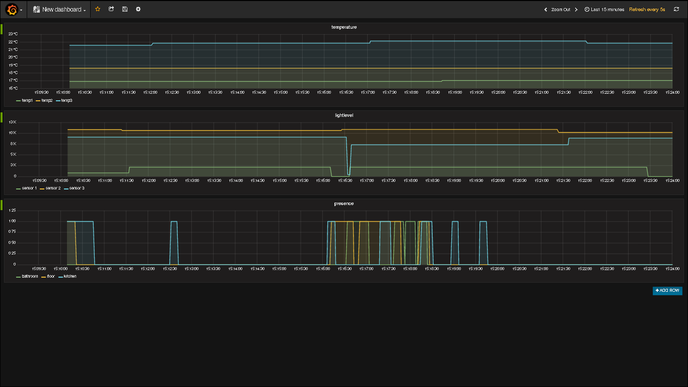

# py-hue-influxdb
Simple Python script to poll sensor data fro HUE bridge and store the data InfluxDb.

Values for presence sensor are converted to integer to make graphing easier.

I use this script to graph the data with [Grafana](http://grafana.org/).

